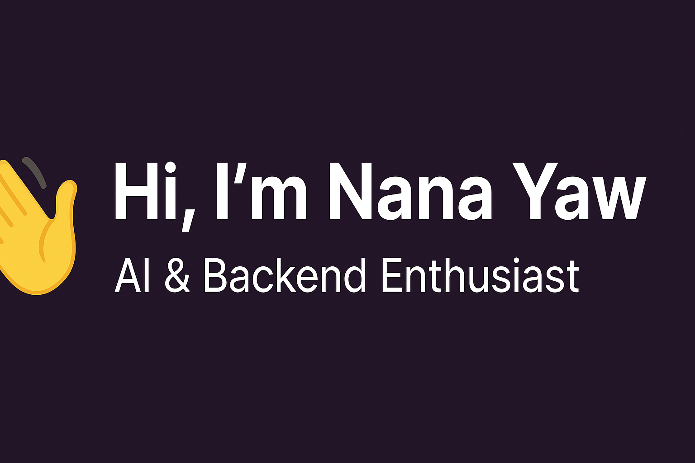

# Hi there 👋, I'm Nana Yaw Gyamfi Mensah  

🎓 A Computer Science student at the University of Cape Coast, Ghana.  
💡 Passionate about Artificial Intelligence, Backend Development, and Problem-Solving.  
🚀 Building skills in Python, Django, and Data Science.  

---

## 🌟 About Me  
- 🔭 Currently working on: Django & Python backend projects  
- 🌱 Learning: AI & Machine Learning  
- 👯 Open to collaborate on: AI and open-source backend projects  
- 💬 Ask me about: Python, Django, SQL, Git  
- 📫 Reach me at: **nygyamfimens@gmail.com**  
- ⚡ Fun fact: I play basketball 🏀 (Power Forward)  

---

## 🛠️ Languages & Tools  
  
  
  
  
  

---

## 📊 GitHub Stats  
  

  

---

## 🌍 Connect With Me  
- [LinkedIn](https://www.linkedin.com/in/nana-yaw-gyamfi-mensah-803458381?trk=contact-info)  

---

⭐️ From [nygyamfi](https://github.com/nygyamfi)
